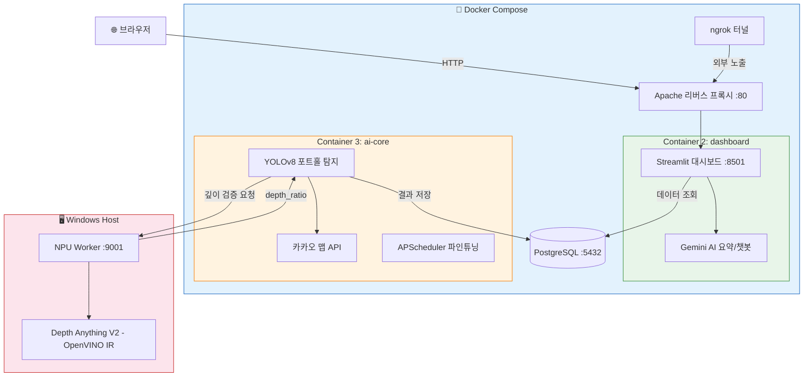
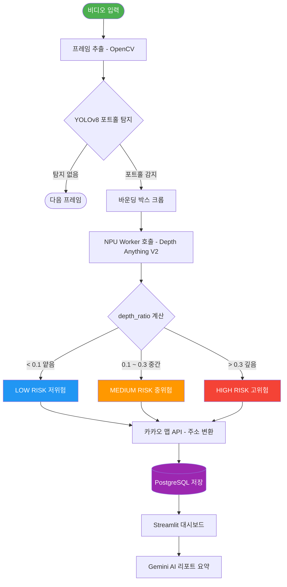
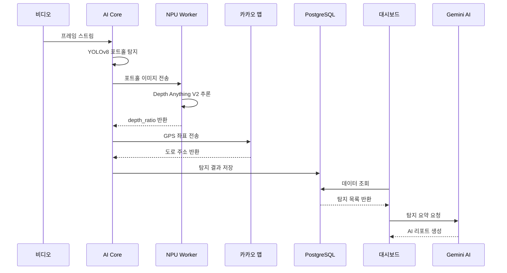
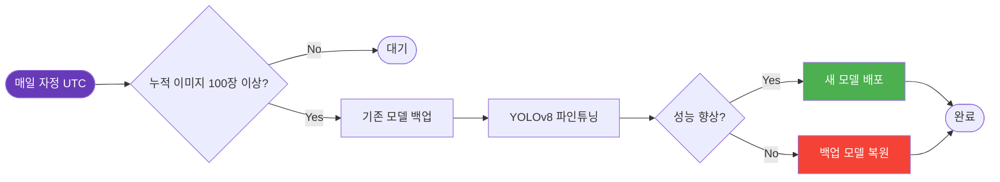
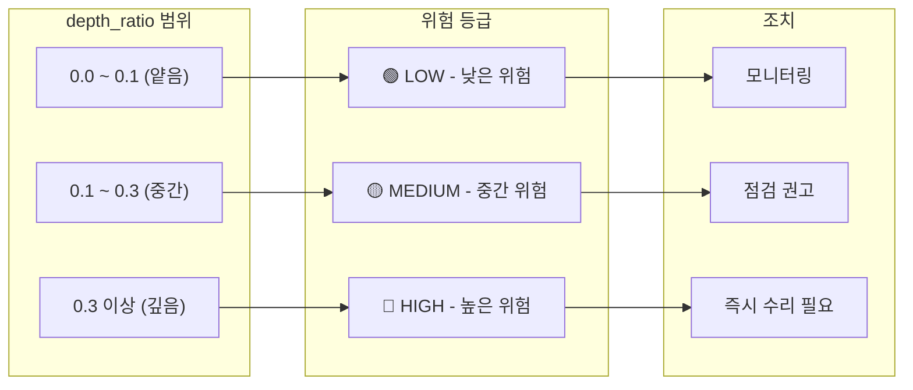

# Deep-Guardian

**AI 기반 도로 포트홀 탐지 · 깊이 검증 · 위험도 관리 시스템**

YOLOv8 커스텀 모델로 비디오에서 포트홀을 탐지하고, Intel NPU/OpenVINO의 Depth Anything V2로 깊이를 검증하여 위험도를 분류합니다. Streamlit 대시보드와 Gemini/Phi-3 챗봇으로 결과를 시각화·관리합니다.

---

## 목차

- [주요 기능](#주요-기능)
- [시스템 아키텍처](#시스템-아키텍처)
- [포트홀 탐지 파이프라인](#포트홀-탐지-파이프라인)
- [데이터 흐름](#데이터-흐름)
- [자동 파인튜닝 스케줄](#자동-파인튜닝-스케줄)
- [위험도 분류 기준](#위험도-분류-기준)
- [기술 스택](#기술-스택)
- [사전 요구사항](#사전-요구사항)
- [빠른 시작](#빠른-시작)
- [환경 변수 설정](#환경-변수-설정)
- [프로젝트 구조](#프로젝트-구조)
- [API 레퍼런스](#api-레퍼런스)

---

## 주요 기능

| 기능 | 설명 |
|------|------|
| **포트홀 탐지** | YOLOv8 커스텀 모델로 비디오/이미지에서 실시간 포트홀 탐지 |
| **깊이 검증** | Intel NPU + Depth Anything V2 (OpenVINO IR)로 깊이 비율 계산 및 위험 포트홀 필터링 |
| **위험도 분류** | `depth_ratio` 기반 위험 등급(HIGH/MEDIUM/LOW) 자동 분류 |
| **위치 변환** | GPS 좌표 → 카카오 맵 API로 실제 도로 주소 변환 |
| **웹 대시보드** | Streamlit 기반 통계, 지도 시각화, 결과 영상 재생 |
| **AI 요약/챗봇** | Gemini API / Phi-3 (OpenVINO) 기반 탐지 결과 요약 및 챗봇 |
| **자동 파인튜닝** | 누적 탐지 데이터로 매일 자정 자동 모델 재학습 (APScheduler) |
| **합성 데이터 생성** | 포트홀 합성 이미지 자동 생성으로 학습 데이터 증강 |
| **외부 터널링** | ngrok / Cloudflare Tunnel로 외부 공개 URL 생성 |

---

## 시스템 아키텍처



---

## 포트홀 탐지 파이프라인



---

## 데이터 흐름



---

## 자동 파인튜닝 스케줄



---

## 위험도 분류 기준



---

## 기술 스택

**AI / ML**
- [YOLOv8](https://github.com/ultralytics/ultralytics) — 포트홀 객체 탐지
- [Depth Anything V2](https://github.com/DepthAnything/Depth-Anything-V2) — 단안 깊이 추정 (OpenVINO IR)
- [Intel OpenVINO](https://github.com/openvinotoolkit/openvino) — NPU 추론 가속
- [Phi-3-mini](https://huggingface.co/microsoft/Phi-3-mini-4k-instruct) — 경량 LLM 챗봇 (OpenVINO GenAI)

**Backend / DB**
- Python 3.10+, Django ORM, Flask
- PostgreSQL 15
- APScheduler (자동 파인튜닝 스케줄러)

**API**
- Kakao Map API — GPS 좌표 → 도로 주소 변환
- Google Gemini API — AI 요약 및 챗봇

**Frontend / 인프라**
- Streamlit — 대시보드
- Apache — 리버스 프록시
- Docker / Docker Compose
- ngrok / Cloudflare Tunnel

---

## 사전 요구사항

- **OS**: Windows 10/11 (NPU Worker는 Windows 전용)
- **Docker Desktop** (WSL2 백엔드 권장)
- **Python 3.10+** (NPU Worker용 가상환경)
- **Intel OpenVINO** 설치
- **Intel NPU** 또는 CPU

---

## 빠른 시작

### 1. 저장소 클론

```bash
git clone https://github.com/2101070-LJI/pothole-detection-system.git
cd pothole-detection-system
```

### 2. 환경 변수 설정

```bash
cp .env.example .env
# .env 파일을 열어 API 키 입력
```

### 3. 모델 파일 준비

```
ai-core/models/best2.pt                   ← YOLOv8 커스텀 모델
<경로>/depth_npu/openvino_model.xml       ← Depth Anything V2 (OpenVINO)
<경로>/depth_npu/openvino_model.bin
```

### 4. Docker 실행

```powershell
docker compose up -d --build
docker compose ps
```

### 5. NPU Worker 실행 (Windows Host)

```powershell
# 최초 1회 설치
python -m venv venv-deep-guardian
.\venv-deep-guardian\Scripts\Activate.ps1
pip install -r requirements_slm_npu.txt

# 워커 시작
python npu_worker.py `
  --model "C:\your\path\to\openvino_model.xml" `
  --device AUTO:NPU,CPU `
  --port 9001
```

### 6. 접속

| 서비스 | URL |
|--------|-----|
| 메인 대시보드 | http://localhost |
| Streamlit 직접 | http://localhost:8501 |
| NPU Worker 헬스 체크 | http://localhost:9001/health |

---

## 환경 변수 설정

`.env.example`을 복사 후 `.env`에 실제 값 입력:

```env
GEMINI_API_KEY=your_gemini_api_key_here
GEMINI_MODEL=gemini-1.5-flash
NGROK_AUTHTOKEN=your_ngrok_authtoken_here
KAKAO_MAP_APP_KEY=your_kakao_map_app_key_here
```

| 변수 | 발급처 | 용도 |
|------|--------|------|
| `GEMINI_API_KEY` | [Google AI Studio](https://aistudio.google.com/apikey) | AI 요약/챗봇 |
| `NGROK_AUTHTOKEN` | [ngrok Dashboard](https://dashboard.ngrok.com) | 외부 터널링 |
| `KAKAO_MAP_APP_KEY` | [Kakao Developers](https://developers.kakao.com) | 지도/주소 변환 |

> **주의**: `.env` 파일은 절대 git에 커밋하지 마세요.

---

## 프로젝트 구조

```
pothole-detection-system/
├── ai-core/                    # AI 엔진 컨테이너
│   ├── main.py                 # 메인 처리 서버 (YOLOv8 탐지 + APScheduler)
│   ├── synthetic_pothole_generator.py
│   ├── models/                 # YOLOv8 모델 (best2.pt 배치)
│   ├── videos/                 # 입력 비디오
│   └── Dockerfile
├── apache/                     # 리버스 프록시 컨테이너
│   ├── httpd.conf
│   └── Dockerfile
├── dashboard/                  # Streamlit 대시보드 컨테이너
│   ├── app.py                  # 메인 대시보드
│   ├── auth.py                 # 로그인/인증
│   ├── gemini_summary.py       # Gemini AI 요약
│   ├── road_chatbot.py         # 도로 상태 챗봇
│   ├── live_video_stream.py    # 실시간 영상 스트리밍
│   └── Dockerfile
├── database/
│   └── init.sql                # PostgreSQL 스키마 초기화
├── django_app/                 # Django ORM 모델 정의
│   ├── models.py               # Pothole, User 모델
│   └── settings.py
├── cloudflared/                # ngrok 터널 컨테이너
│   ├── config.yml
│   └── Dockerfile
├── npu_worker.py               # Intel NPU 깊이 추정 HTTP 서버
├── slm_npu_worker_phi3.py      # Phi-3 LLM 워커 (OpenVINO GenAI)
├── docker-compose.yml          # 메인 5컨테이너 구성
├── docker-compose-optimized.yml
├── .env.example                # 환경 변수 템플릿
├── requirements.txt
└── requirements_slm_npu.txt    # NPU Worker 의존성
```

---

## API 레퍼런스

### NPU Worker (`:9001`)

| 메서드 | 경로 | 설명 |
|--------|------|------|
| `GET` | `/health` | 서버 및 모델 상태 확인 |
| `POST` | `/depth` | 이미지 깊이 추정 |
| `POST` | `/load_model` | 런타임 모델 로드 |

**깊이 추정 예시:**

```bash
curl -X POST http://localhost:9001/depth \
  -F "image=@pothole.jpg"
```

```json
{
  "success": true,
  "depth_ratio": 0.2345,
  "validation_result": true,
  "depth_map_shape": [518, 518],
  "depth_min": 0.0,
  "depth_max": 1.0
}
```

---

## 라이선스

MIT License
