# Deep-Guardian 프로젝트 아키텍처 블록도

## 📊 전체 시스템 아키텍처

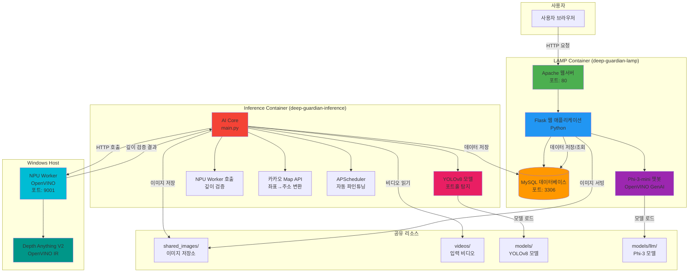

---

## 🔄 데이터 처리 흐름

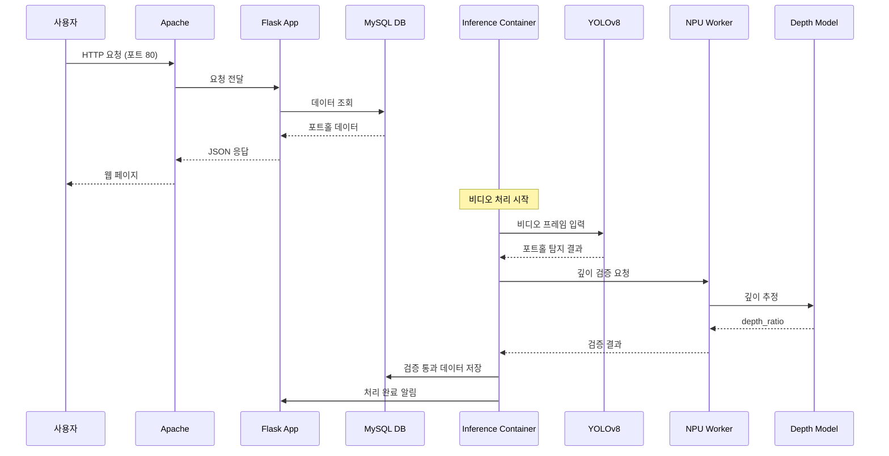

---

## 🏗️ 컨테이너 상세 구조

### LAMP Container (deep-guardian-lamp)

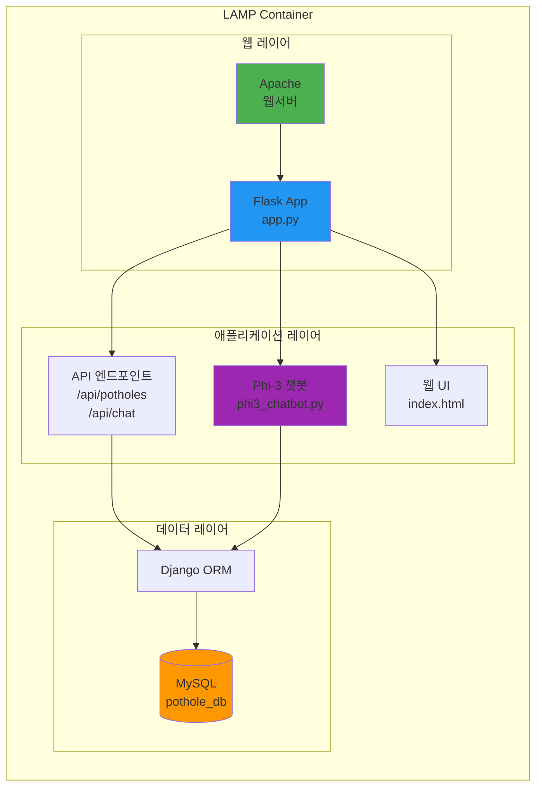

### Inference Container (deep-guardian-inference)

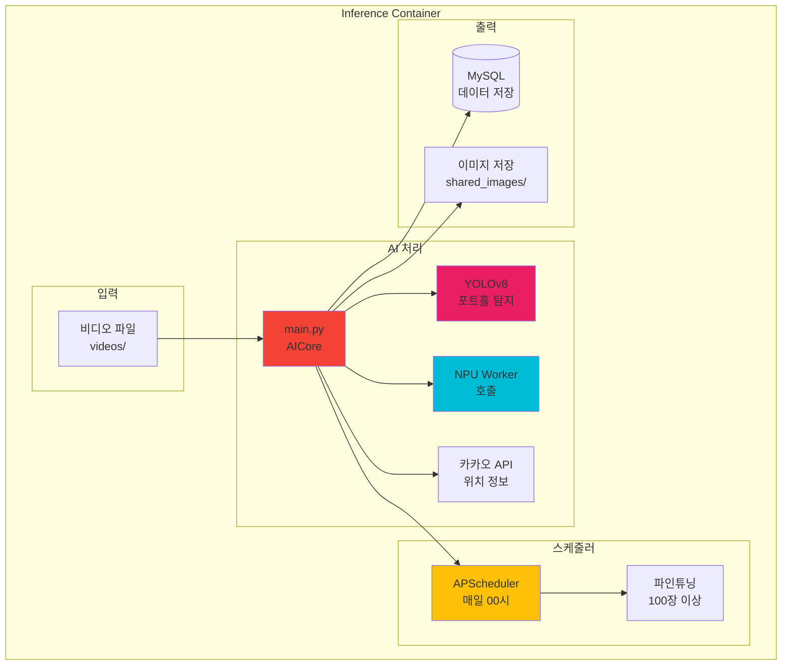

---

## 🔌 네트워크 구조

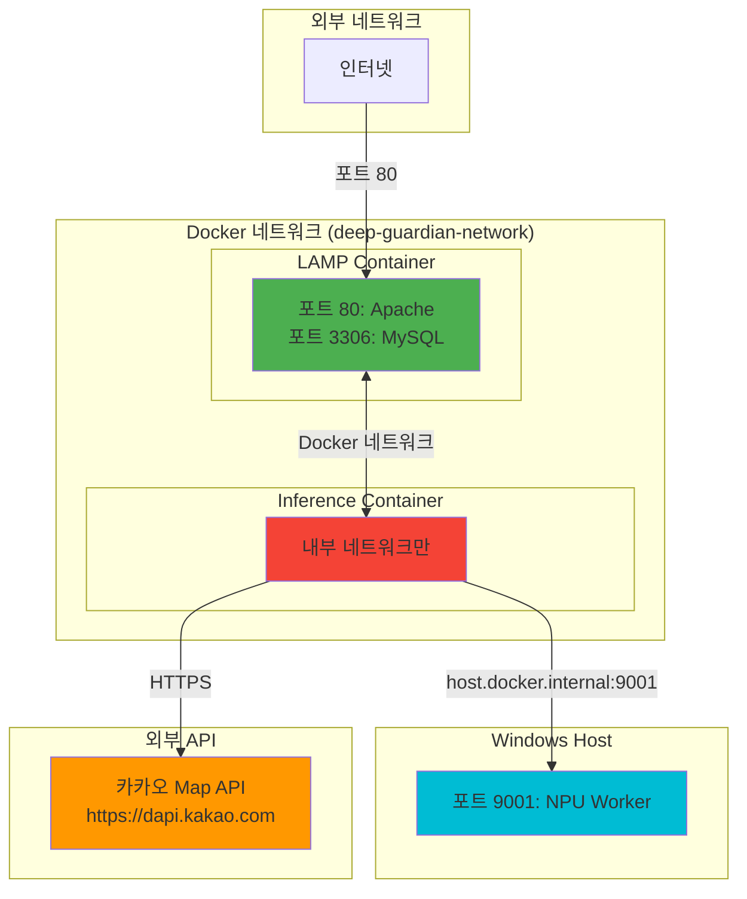

---

## 📦 볼륨 마운트 구조

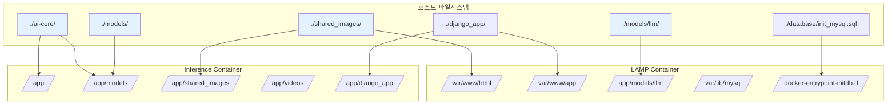

---

## 🔄 자동 파인튜닝 프로세스

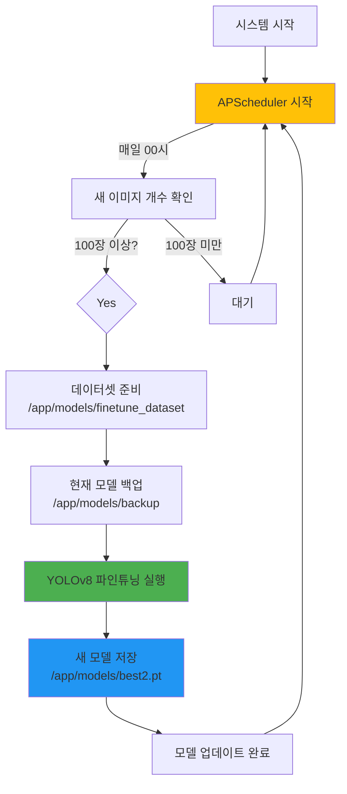

---

## 💬 챗봇 통신 흐름

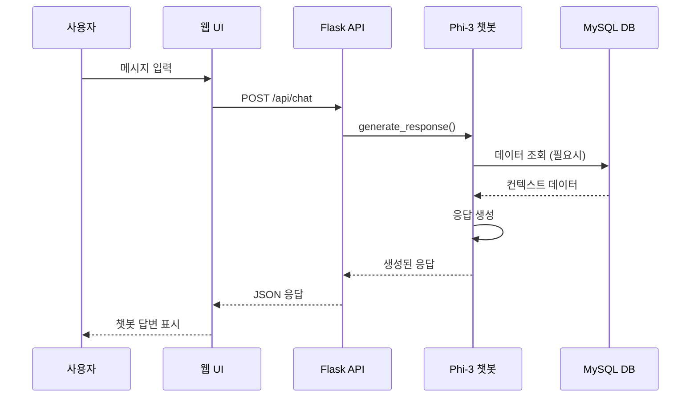

---

## 🗄️ 데이터베이스 스키마

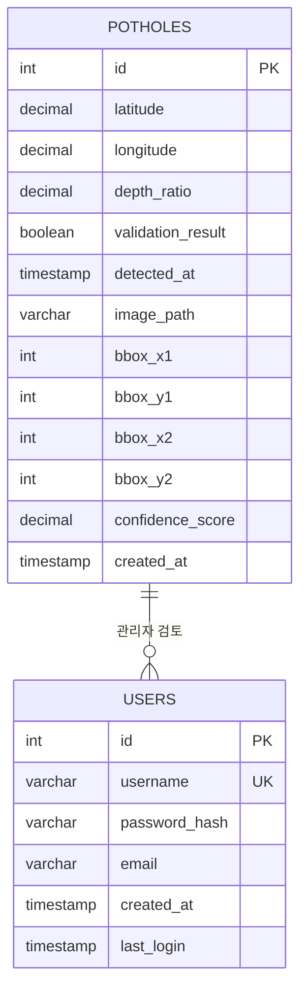

---

## 📋 주요 기능 블록

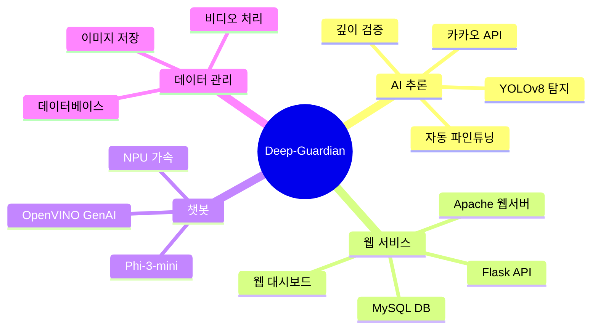

---

## 🔧 기술 스택

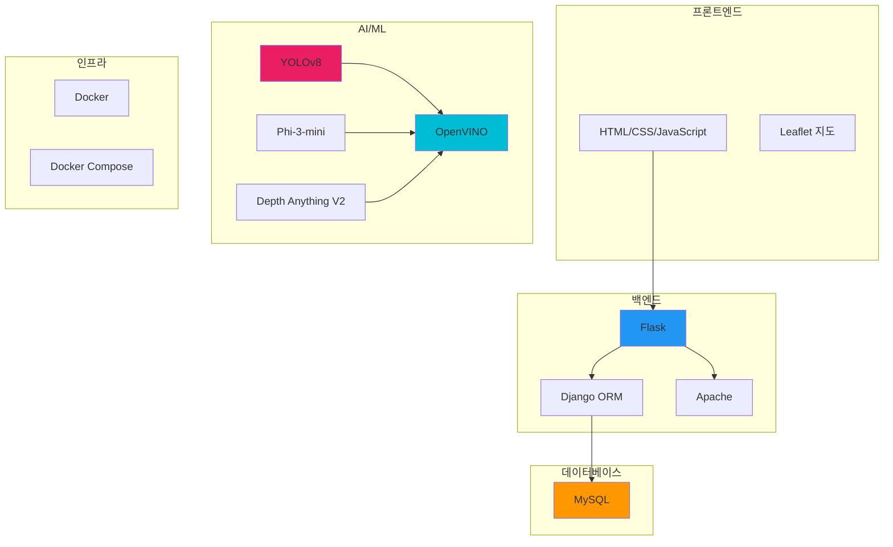

---

## 📝 참고사항

- **Mermaid 다이어그램**: GitHub, GitLab, 많은 마크다운 뷰어에서 지원
- **시각화 도구**: 
  - [Mermaid Live Editor](https://mermaid.live/) - 온라인에서 확인
  - VS Code 확장: "Markdown Preview Mermaid Support"
  - GitHub/GitLab: 자동 렌더링

---

## 🎯 핵심 포인트

1. **2개 컨테이너 구조**: LAMP + Inference
2. **Windows Host NPU Worker**: 깊이 검증 전용
3. **통합 챗봇**: LAMP 컨테이너 내부에서 실행
4. **자동화**: 파인튜닝 스케줄러 포함
5. **API 통합**: 카카오 Map API 연동

